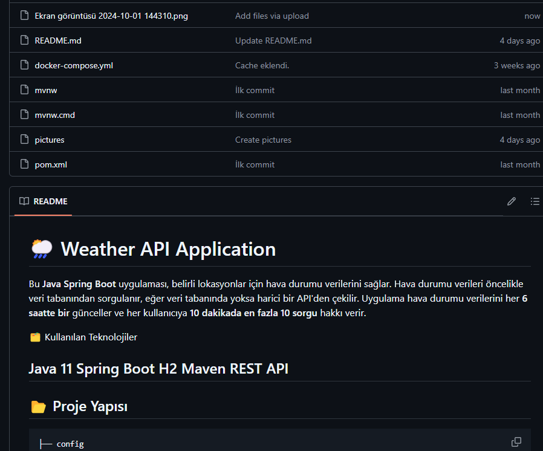

# 🌦️ Weather API Application
Bu **Java Spring Boot** uygulaması, belirli lokasyonlar için hava durumu verilerini sağlar. Hava durumu verileri öncelikle veri tabanından sorgulanır, 
eğer veri tabanında yoksa harici bir API'den çekilir. Uygulama hava durumu verilerini her **6 saatte bir** günceller ve her kullanıcıya **10 dakikada en fazla 10 sorgu** hakkı verir.

🗂️ Kullanılan Teknolojiler

Java 11
Spring Boot
H2
Maven
REST API
---

## 📂 Proje Yapısı

```bash
├── config
│   └── RestTemplateConfig.java        # REST client konfigürasyonu
├── constants
│   └── Constants.java                 # Uygulama içinde kullanılan sabitler
├── controller
│   └── WeatherAPI.java                # Hava durumu isteklerini yöneten REST controller
├── dto
│   ├── Data.java                      # Hava durumu verilerini içeren DTO
│   ├── Location.java                  # Lokasyon detaylarını içeren DTO
│   ├── Values.java                    # Hava durumu değerlerini içeren DTO
│   ├── WeatherDto.java                # Gelen hava durumu isteklerinin DTO'su
│   └── WeatherResponse.java           # API'den gelen yanıtların DTO'su
├── model
│   └── WeatherEntity.java             # Veri tabanında hava durumu verisini temsil eden entity
├── repository
│   └── WeatherRepository.java         # Hava durumu verisi için JPA repository interface'i
├── service
│   └── WeatherService.java            # Hava durumu iş mantığını yöneten service katmanı
├── resources
│   └── application.yml                # Uygulama konfigürasyonları (ör. veri tabanı, API anahtarları)
└── WeatherApplication.java            # Spring Boot uygulamasının ana giriş noktası

  🌟 Özellikler
Hava Durumu Veri Çekimi: Hava durumu verileri veri tabanından veya harici bir API'den alınır.
Önbellekleme: Hava durumu verileri 6 saat boyunca önbelleğe alınır. Aynı şehir için yapılan istekler bu süre içinde tekrarlanırsa önbellekteki veri döndürülür.
Sınırlı İstek Hakkı: Her kullanıcı, 10 dakika içinde en fazla 10 istek yapabilir.
Veri Tabanı Entegrasyonu: Hava durumu verileri veri tabanına kaydedilir.
Harici API Entegrasyonu: Harici bir API'den hava durumu verisi çekilir (eğer veri tabanında yoksa).

> **Örnek JSON Cevabı:**
```json
{
  "data": {
    "time": "2024-09-10T17:56:00Z",
    "values": {
      "cloudBase": null,
      "cloudCeiling": null,
      "cloudCover": 0,
      "dewPoint": 20.38,
      "freezingRainIntensity": 0,
      "humidity": 76,
      "precipitationProbability": 0,
      "pressureSurfaceLevel": 988.4,
      "rainIntensity": 0,
      "sleetIntensity": 0,
      "snowIntensity": 0,
      "temperature": 25,
      "temperatureApparent": 25,
      "uvHealthConcern": 0,
      "uvIndex": 0,
      "visibility": 16,
      "weatherCode": 1000,
      "windDirection": 210.5,
      "windGust": 3.88,
      "windSpeed": 2.19
    }
  },
  "location": {
    "lat": 37.143798828125,
    "lon": 35.4984092712402,
    "name": "Adana, Akdeniz Bölgesi, Türkiye",
    "type": "administrative"
  }
}

